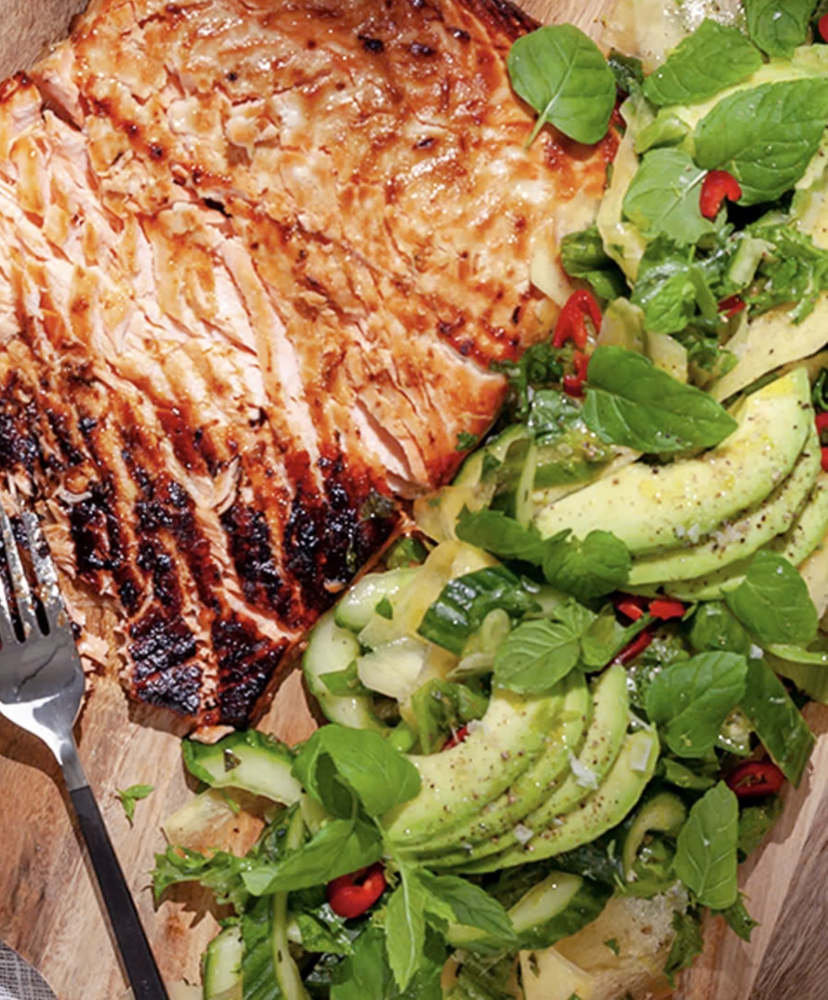

Hel grillad lax med en otroligt god glaze med ingefära och miso serveras med en frisk och god mangosallad. Somrigt, vackert och gott!

Total: 00 h 50 min

Portioner: 4

Ingredienser:
- 2 msk Misopasta
- 1 msk Rapsolja
- 1 tsk Flingsalt
- 2 klyfta Vitlök Vanlig
- 600 g Färsk laxfilé
- 2 msk Japansk soja
- 1 st Lime
- 1 msk Färsk ingefära
- 1 msk Rapsolja
- 1 msk Färsk ingefära
- 1 krm Svartpeppar
- 1 st Chilipeppar Röd
- 3 krm Salt
- 2 st Avokado
- 65 g Salladslök
- 2 st Lime
- 1 st Gurka
- 35 g Machesallat
- 1 st Mynta - färsk
- 2 st Mango Färsk

Instruktioner:
1. Tänd grillen i lagom tid och läs gärna igenom hela beskrivningen innan du börjar laga din grillmiddag.
2. Lax: Lägg den hela laxfilén på ett fat/skärbräda, behåll skinnet på. Krydda med flingsalt.
3. Skala och riv vitlök och ingefära. Blanda samman vitlök, ingefära, misopasta, soja, olja och limesaft till en glaze.
4. Grilla den hela laxen med skinnsidan nedåt på utegrillen i ca 5 min. Pensla laxen med glazen. Lägg sedan på locket på grillen och låt laxen grilla klart i ca 15-20 min.
5. Mangosallad: Skala mangon och hyvla tunna mangoskivor med hjälp av en potatisskalare. Halvera gurkan på längden och gröp ur det vattniga med en sked. Skär gurkan i bitar. Skölj och strimla salladslök och chilipeppar. Skala och riv ingefära och grovhacka myntan.
6. Blanda samman alla grönsaker i en skål och tillsätt rivet limeskal, limesaft och olja. Smaka av med salt och peppar.
7. Lägg upp machesalladen på ett fat/skärbräda och toppa med mangosalladen. Skär avokadon i skivor och fördela fint på salladen. Dekorera med lite extra myntablad.

Servera den grillade laxen tillsammans med mangosalladen.

[Källa: https://www.mathem.se/se/recipes/1120-mari-bergman-asiatisk-grillad-lax-med-mangosallad/]

#Lax