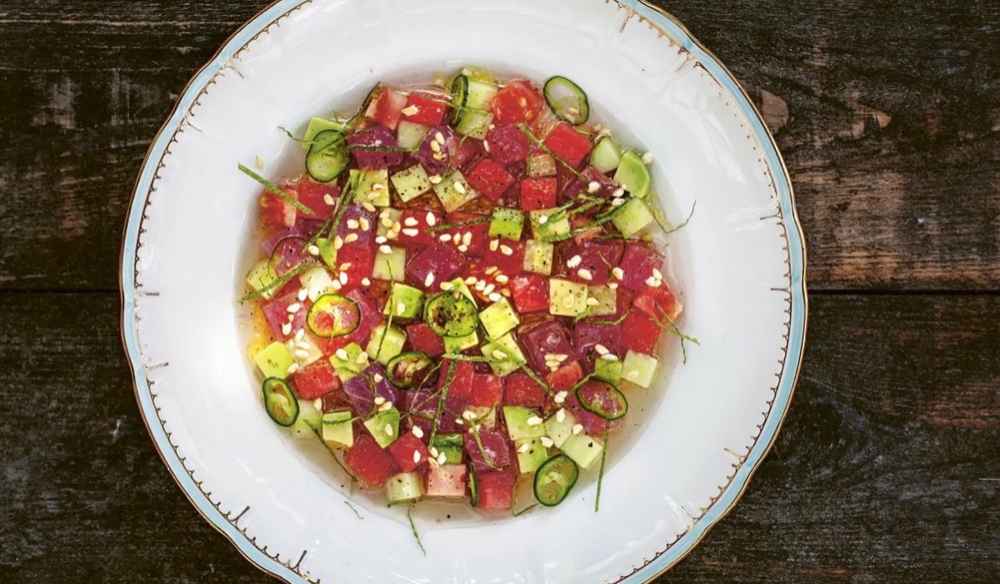

## Ingredienser
1 dl sushiris
1 stor mogen bifftomat
1 gurka
¼ normalstor vattenmelon
cirka 300 g tonfiskfilé
2 avokado
1 knippe färsk mynta
2 gröna chilifrukter
1 dl citronsaft
½ dl olivolja
salt
nymalen svartpeppar

## Beskrivning
1. Rosta riset i en torr stekpanna på medelvärme tills det blir lite gyllene och börjar poppa. Lägg upp på ett fat och låt svalna.
2. Skär ett snitt i tomaten och lägg ner den i kokande vatten tills skalet börjar lossna, cirka 30 sekunder. Skölj den i iskallt vatten och skala tomaten. Skär sedan i 1 x 1 cm stora bitar.

3. Skala gurkan och skär i 1 x 1 cm stora bitar.

4. Skär bort skalet från vattenmelonen och skär i 1 x 1 cm stora bitar.

5. Tärna tonfisken i 1 x 1 cm stora bitar.

6. Dela avokado och skär i 1 x 1 cm stora bitar. Lägg i en skål med vatten och lite citronsaft så att den inte blir geggig.
7. Mynta o chilin

#Sallad #Tapas #Förrätt #Fisk