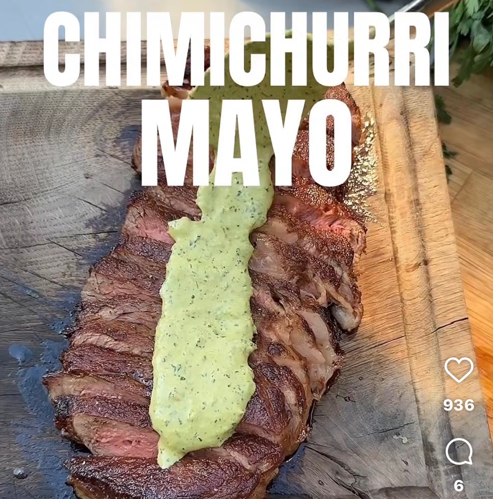

## Ingredienser
*2 dl persilja (typ två krukor)
*0,5 dl olivolja
*0,5 dlcitronjuice
*1-2 st schalottenlök (beroende på storlek)
*1-2 klyftor vitlök
*1 st färsk chili (mer eller mindre beroende på hur
starkt du gillar)
*salt och peppar
*1-2 dl mayo (justera efter smak och konsistens)

## Beskrivning
Ca 8 pers

#Sås