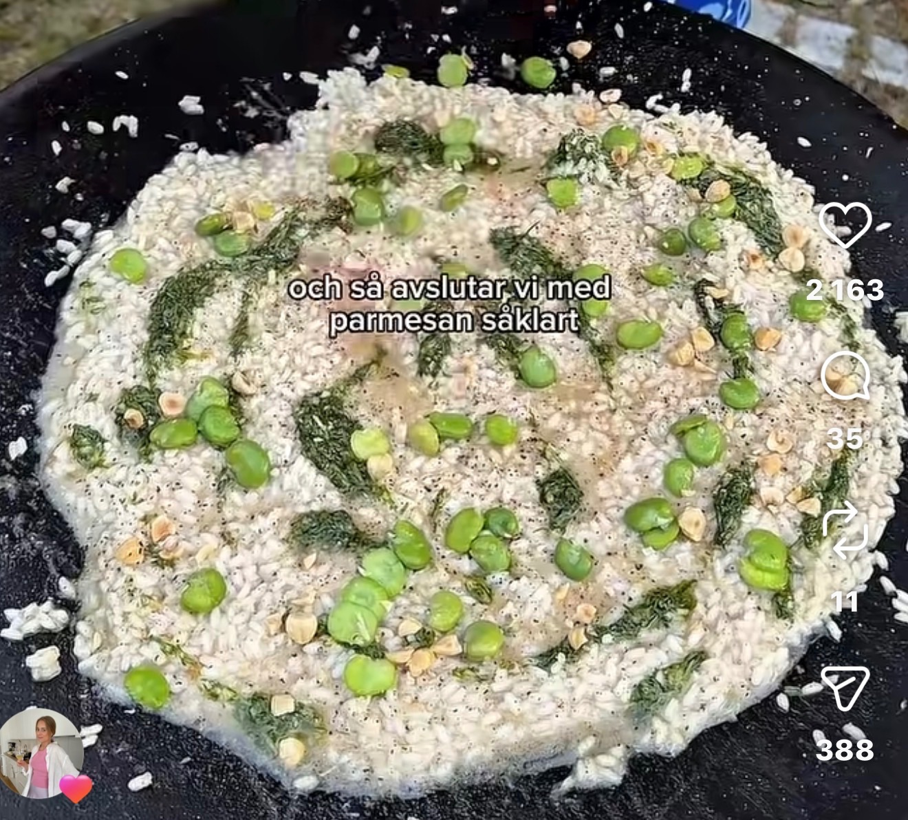

## Ingredienser
1 stor bananschalottenlok (finhackad)
3 msk olivolja
3 dl risottoris
2 dl vitt vin
8 dl varm kycklingbuljong
1 citron (zest + saft)
100 g smör
100 g parmesanost (riven)
Salt och nymalen svartpeppar
Dillgremolata
1 knippe dill (finhackad)
½ chili (finhackad)
1 citron (zest + saft)
1,5 dl olivolja
1 msk honung
1-2 msk vinäger
Salt o peppar

## Beskrivning
GÖR SÅ HÄR
Dillgremolata
Blanda dill, chili, citronzest, citronsaft, olivolja, honung och vinäger. Smaka av med salt och låt dra.
Citronrisotto
Fräs löken mjuk i olivolja. Tillsätt riset och låt det fräsa glansigt. Häll i vinet och låt koka in. Späd successivt med varm buljong under omrörning tills riset är al dente, ca 18 min.
Ta kastrullen från värmen. Rör ner citronzest, citronsaft, smör och parmesan för en krämig konsistens. Smaka av med salt och peppar.

#Vegetariskt