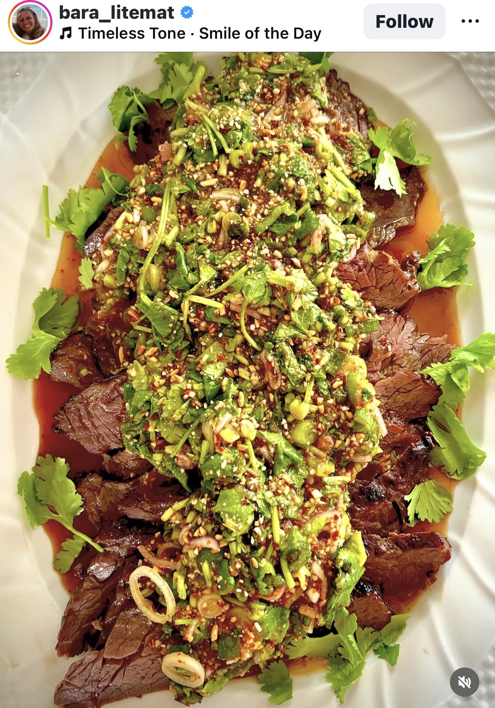

Crying tiger Marinad till köttet:
 2 msk ostronsås
 1 msk fisksås
 2 msk soja
 1-2 vitlöksklyftor
 1/2 tsk vitpeppar
 1 msk brunsocker
(Om du har några korianderrötter är det gott att mortla dessa tillsammans med vitlöken i marinaden).
Sås (Nam Jim Jaew):
 2 salladslökar, tunt skivade
 1 dl grovhackad koriander – ta med stjälkarna fast hacka dem väldigt fint
 1 schalottenlök, hackad
 3 msk fisksås
 3 msk lime juice
 4 msk honung
 2 msk tamarind koncentrat el tamarindpasta
 1/2 dl rostat ris pulver, mortlat
 1-2 msk torkad chili
 2-4 msk vatten – prova till lagom rinnande konsistens
Köttet:
Marinera köttet helst minst 4 timmar. Mortla vitlöken (och 3-4 korianderrötter) blanda sedan med övriga ingredienser och marinera köttet.
Sås:
Rosta riset (okokt) i en het, torr panna under konstant omrörning tills det är gyllene och doftar popcorn. Låt svalna och mortla sedan till grovt pulver.
Hacka örterna och salladslöken. Lägg i en skål.
Tillsätt honung, fisksås, tamarind, lime och chili. Rör ihop till en jämn smet och smaka av.
Tillsätt till sist rispulvet och tunna ut såsen med vatten till lagom konsistens. Smaka av med ev mer lime el fisksås.
Servera...

#Kött