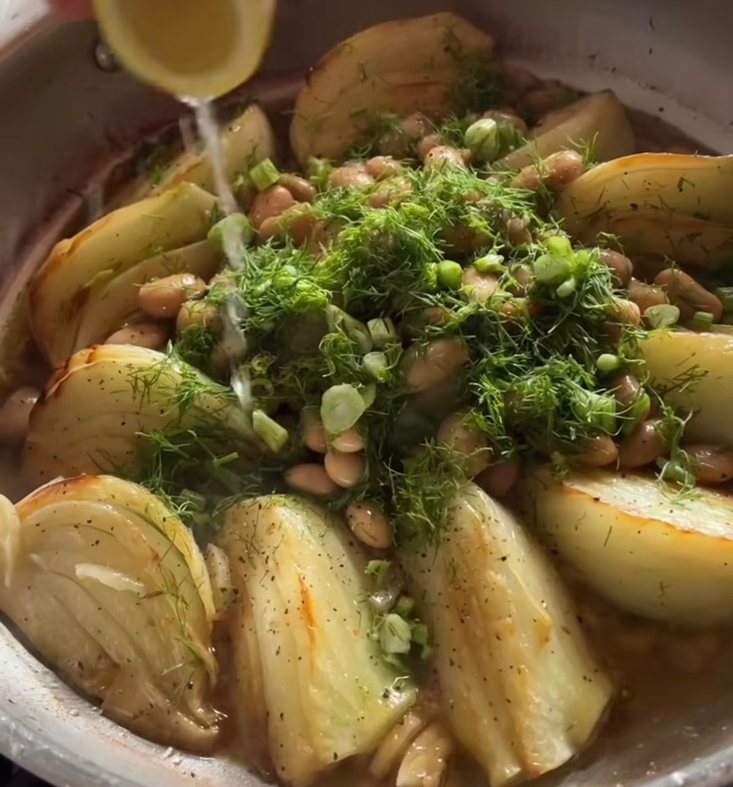

## Ingredienser
1 large head fennel, trimmed, tops reserved
¼ cup olive oil + extra to drizzle
Salt, pepper
3 clove garlic, roughly chopped
1 cup white wine
1 tin butterbeans, drained, rinsed - or black
½ tsp dried chili flakes
1 lemon

## Beskrivning
Method
Place a large frying pan over a medium/high heat and add the olive oil and fennel.
Season well with salt and pepper and cook for a couple of minutes, until it begins to colour.
Then flip the fennel onto the other cut side and cook until that begins to caramelise nicely.
Scatter the garlic over the fennel and gently shake the pan to let the garlic fall through.
Add the white wine to the pan, reduce the heat and cover with a lid. Simmer the fennel for 8-10 minutes, topping up with a little water if needed then remove the lid and scatter over the dried chili.
To serve, roughly slice the reserved fennel tops and add to the pan with thebutterbeans, squeeze over the lemon and finish with an extra drizzle of olive oil.

#Tapas #Tillbehör #Vegetariskt