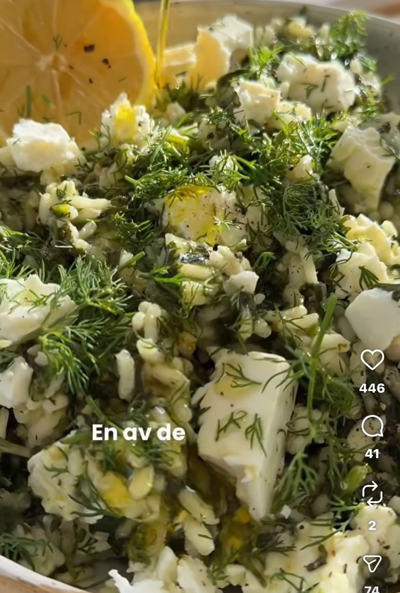

## Ingredienser
RECEPT (4 port)
• 4 msk olivolja
• 1 gul lök, finhackad
• 2-3 vitlöksklyftor, finhackade
• 2,5 dl rundkornigt ris, t.ex risottoris
• 5-6 dl grönsaksbuljong eller vatten
• 300 g färsk spenat, grovhackad
• 1 näve färsk dill, hackad
• 1 citron, saften
• 1 tsk salt
• 1/2 tsk svartpeppar
• 100 g fetaost

## Beskrivning
1. Fräs lök och vitlök och i olivolja tills mjukt.
2. Häll i riset, rör runt 1-2 min tills det blir blankt.
3. Lagg i spenaten, lite i taget och rör runt.
4. Tillsatt uppkokt buljong/vatten, salt och peppar.
Sjud under lock ca 15-18 min tills riset är lagom mjukt
och vätskan absorberats.
5. Dra av från värmen, rör ner dill och citronsaft och smaka av.
6. Låt dra några minuter och toppa med feta och lite olivolja.

#Vegetariskt