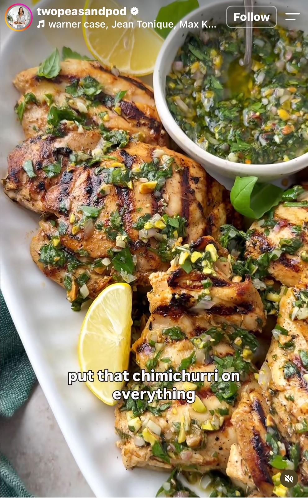

## Ingredienser
Benfria, skinnfria kycklinglårfiléer
 Naturell grekisk yoghurt
 Vitlök
 Olivolja
 Citronskal och citronsaft
 Rödvinsvinäger
 Färsk persilja, basilika och timjan
 Paprikapulver
 Flingsalt / Grovsalt
 Chiliflakes

Pistachio Chimichurri – Ingredienser
 Färsk persilja och basilika
 Vitlök
 Schalottenlök
 Extra jungfruolivolja
 Pistagenötter
 Färsk citronsaft och citronskal
 Rödvinsvinäger
 Flingsalt och svartpeppar
 Chiliflakes

## Beskrivning
1. Blanda marinaden: Rör ihop grekisk yoghurt, olivolja, finhackad vitlök, citronskal, citronsaft, rödvinsvinäger, finhackade färska örter (persilja, basilika, timjan), paprikapulver, salt och chiliflakes i en skål eller en återförslutningsbar plastpåse.
2. Marinera: Lägg i kycklinglårfiléerna och se till att alla bitar täcks ordentligt av marinaden. Täck över skålen eller förslut påsen och låt vila i kylskåpet i minst 30 minuter, gärna upp till 2–4 timmar för bästa resultat.
3. Förbered grillen: Värm upp grillen till medelhög värme (ca 200 °C) och olja in grillgallret lätt så att kycklingen inte fastnar.
4. Grilla: Ta upp kycklingen ur marinaden och skaka av överflödig marinad. Lägg kycklinglårfiléerna på grillen och grilla i cirka 5–7 minuter per sida, eller tills de har fått fin färg och innertemperaturen når 72 °C.
5. Vila och servera: Ta av kycklingen från grillen och låt den vila i ca 5 minuter innan du serverar.

Gör så här
1. Hacka ingredienserna: Finhacka färsk persilja, basilika, vitlök och schalottenlök. Hacka pistagenötterna fint så att de fördelas jämnt i såsen och ger lite krisp.
2. Blanda basen: Lägg de hackade örterna, löken och pistagenötterna i en skål. Tillsätt extra jungfruolivolja, färsk citronsaft, citronskal och rödvinsvinäger.
3. Smaksätt: Krydda med flingsalt, nymalen svartpeppar och en nypa chiliflakes för lite hetta om du önskar.
4. Blanda och vila: Rör ihop allt ordentligt. Låt chimichurrin stå i rumstemperatur i minst 15–30 minuter innan servering så att smakerna hinner blomma ut.

#Kyckling