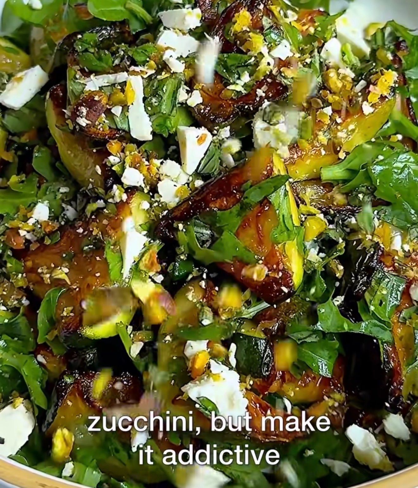

## Ingredienser
4 small zucchini
2-3 tbsp olive oil
3/4 tsp salt
Handful of arugula
•
For the crumble:
1/4 cup pistachios
1/4 cup feta cheese
3 tbsp basil
zest of 1/2 lemon
Salt to taste
Pepper to taste
•
For the tahini:
2 tbsp tahini
1/2 tbsp honey
1 tsp lemon juice
Pinch salt
Water to thin

## Beskrivning
•
•I| 5G 18
Preheat the oven to 425. Place a cast iron pan in the
oven for 15 minutes to get it hot.
2 Slice the zucchini
in half lengthwise, then score the tops of the zucchini diagonally, and then slice into thirds. 3
Add the
zucchini to a plate and top liberally with salt. Let the zucchini sit for 15 minutes then pay dry with paper towels. Do not rinse.
4
Remove the pan from the
oven, add the oil (i used two pans and divided oil in half) then add the zucchini face down. Place in the oven for 30 minutes, flipping halfway.
5 While the
zucchini is roasting, make the crumble. Chop up the pistachios, then add the feta cheese, the basil, lemon zest, salt and pepper. Continue to chop until it creates a nice crumble. 6 Make the drizzle. Add the tahini, honey, lemon juice and salt to a small bowl. Whisk, then add water 1 tablespoon at a time and whisk until desired consistency.
Zadd arugula, Top the zucchini
with the crumble and tahini, if using.

#Tillbehör #Tapas #Vegetariskt