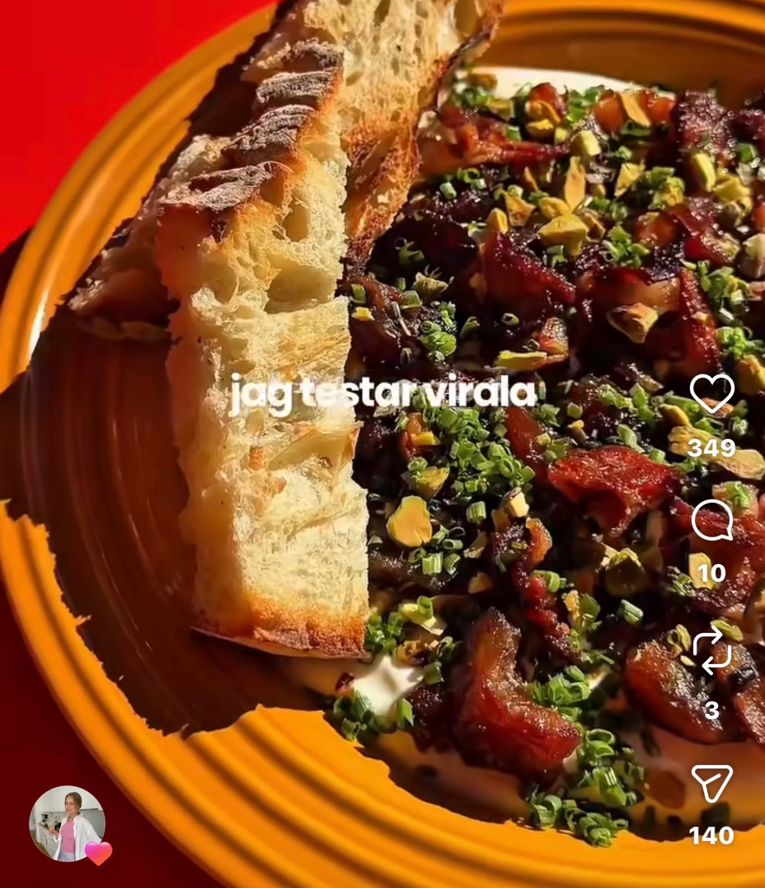

## Ingredienser
En nypa salt
Juice från ½ citron
1 dl grekisk yoghurt
Topping & smaksättning:
1 msk baconfett (från stekningen av baconet)
1 tsk farsk timjan
0,6 dl krispigt bacon, smulat
1,2 dl dadlar, hackade
0,6 dl pistagenötter, grovhackade
2 tsk salt
1 msk olivolja

## Beskrivning
Karamellisera dadlarna
Stek baconet i en kall panna. Ta ut baconet och lägg i de hackade dadlarna i fetten. Rör om då och då tills dadlarna blivit mjuka och harligt karamelliserade. Dra åt sidan och låt svalna något.
Krämig bas
Blanda grekisk yoghurt och citronjuice i en skål. Rör eller vispa tills smeten är helt slät.
Montering
Bred ut yoghurten i ett jämnt lager på ett serveringsfat eller i en vid, grund skål. Strö över det krispiga baconet, de karamelliserade dadlarna och de hackade pistagenötterna.

#Tapas