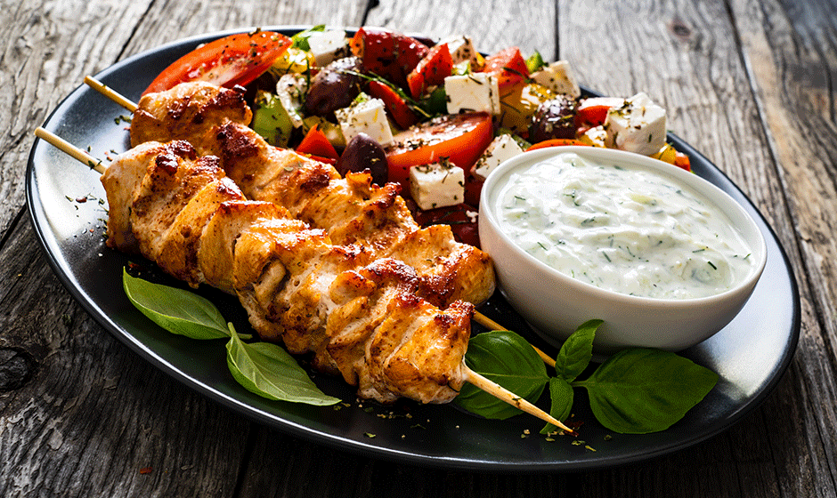

Du behöver
Kycklingsouvlaki
700 g kycklinglårfilé eller kycklingbröstfilé
3 msk olivolja
1 citron, saft och finrivet skal
2 vitlöksklyftor, finrivna
1 msk torkad oregano
1 tsk paprikapulver
1 tsk honung
1 tsk salt
Svartpeppar
Träspett eller metallspett
Grekisk sallad
4 tomater
1 gurka
1 röd paprika
1 liten rödlök
150 g fetaost
1 dl kalamataoliver
2 msk olivolja
1 msk rödvinsvinäger eller citronsaft
1 tsk torkad oregano
Salt
Svartpeppar
Tzatziki
3 dl grekisk yoghurt
½ gurka
1–2 vitlöksklyftor, finrivna
1 msk olivolja
1 tsk citronsaft
1 msk finhackad dill eller mynta, valfritt
Salt
Svartpeppar

Till servering

Pitabröd eller grillat lantbröd
Citronklyftor
Färsk basilika, persilja eller oregano

#Kyckling #Sallad