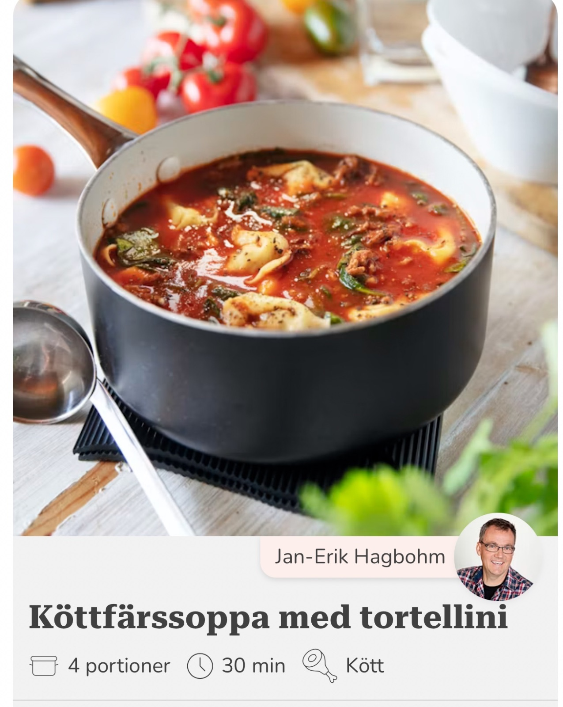

## Ingredienser
https://recept.se/recept/kottfarssoppa-med-tortellini

## Beskrivning
Snabblagad soppa med köttfärs, passerade tomater, kalvbuljong, spenat och färsk tortellini. Servera soppan rykande varm med bröd.

Tillagning: 30 min | Total: 30 min

Portioner: 4

Ingredienser:
- 250 g färsk tortellini
- 200 g nötfärs
- 1 gul lök
- 3 vitlöksklyftor
- 1 msk rökt paprikapulver
- rapsolja till stekning
- 3 dl passerade tomater
- 5 dl kalvbuljong
- 65 g färsk babyspenat
- rivet skal från 1/2 citron
- 1 dl hackad persilja
- salt och peppar
- bröd

Instruktioner:
1. Finhacka löken och vitlöken. Hetta upp lite rapsolja i en kastrull, som ska rymma soppan, och fräs löken och vitlöken någon minut.
2. Tillsätt färsen och låt fräsa tills den får fin färg. Krydda med paprikapulver, salt och peppar.
3. Häll på passerade tomater och kalvbuljong. Låt koka upp. Blanda ner spenat, citronskal och persilja och låt småputtra i ca 10 minuter. Smaka av med salt och peppar.
4. Koka tortellinin enligt anvisningar på paketet. Häll bort kokvattnet och blanda försiktigt ner tortellinin i soppan.
5. Servera soppan rykande varm med bröd.

[Källa: https://recept.se/recept/kottfarssoppa-med-tortellini]