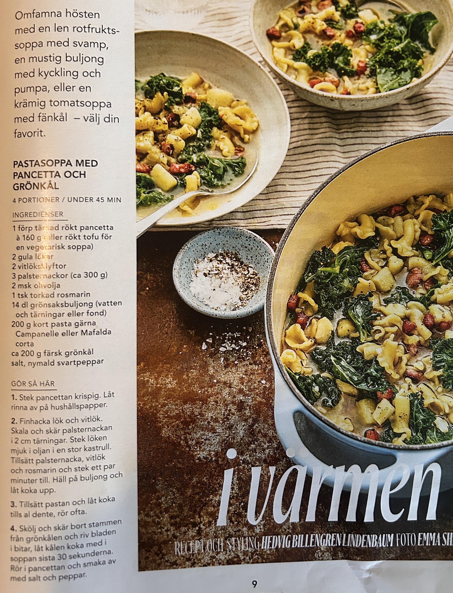

PASTASOPPA MED PANCETTA OCH GRÖNKÅL
4 PORTIONER / UNDER 45 MIN
INGREDIENSER
1 förp tärnad rökt pancetta à 160 g (eller rökt tofu för en vegetarisk soppa)
2 gula lökar
2 vitlöksklyftor
3 palsternackor (ca 300 g)
2 msk olivolja
1 tsk torkad rosmarin
14 dl grönsaksbuljong (vatten och tärningar eller fond)
200 g kort pasta gärna Campanelle eller Mafalda corta
ca 200 g färsk grönkål
salt, nymald svartpeppar
GÖR SÅ HÄR
1. Stek pancettan krispig. Låt rinna av på hushållspapper.
2. Finhacka lök och vitlök. Skala och skär palsternackan i 2 cm tärningar. Stek löken mjuk i oljan i en stor kastrull. Tillsätt palsternacka, vitlök och rosmarin och stek ett par minuter till. Häll på buljong och låt koka upp.
3. Tillsätt pastan och låt koka tills al dente, rör ofta.
4. Skölj och skär bort stammen från grönkålen och riv bladen i bitar, låt kålen koka med i soppan sista 30 sekunderna. Rör i pancettan och smaka

#Soppa