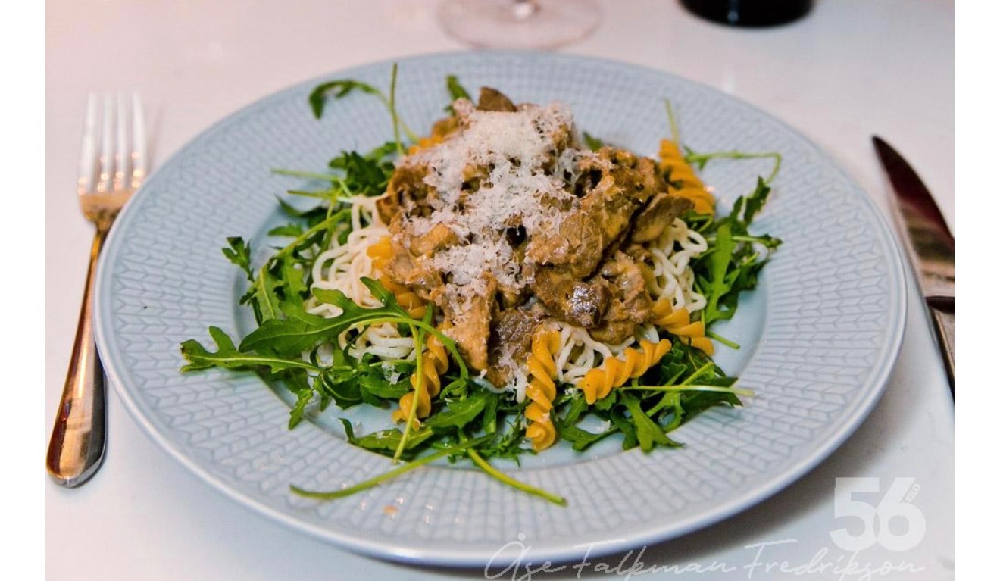

## Ingredienser
1 gul lök
200 gr. kastenjechampinjoner
3 vitlöksklyftor
smör att steka i
1 kg lövbiff, strimlad
2,5 dl vatten
1 köttbuljongtärning
2,5 dl grädde
1 dl creme fraiche
100 g färskost
1/2 msk soja
3 tsk senap
2 msk tomatpuré
1 kruka dragon, grovhackade blad
peppar + ev salt

## Beskrivning
Finhacka lök och vitlök, skär champinjonerna i mindre bitar. Stek all i smör tills de fått fin färg.
Lägg över i gryta.
Stek lövbiffen i smör i het panna i omgångar. Lägg över i grytan.
Rör ner vatten, buljong, grädde, creme fraiche, färskost, soja, senap och resterande ingredienser och låt allt småputtra i 5 minuter. Smaka av med ev mer alt och peppar.

#Pasta #Kött