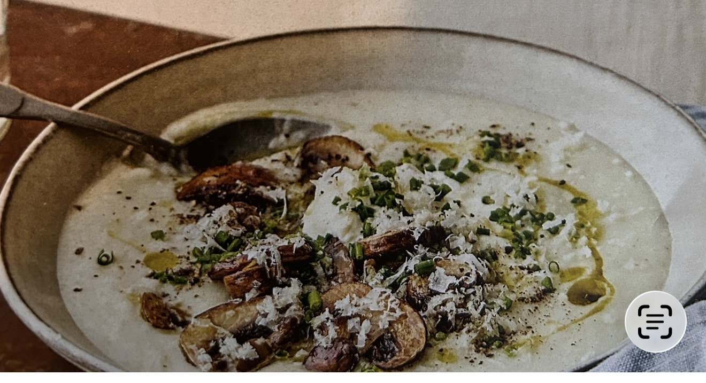

ROTSELLERI- OCH JORDÄRTSKOCKSSOPPA MED SVAMP OCH PEPPARROT
4 PORTIONER / UNDER 45 MIN
INGREDIENSER
 1 gul lök
 2 msk olivolja
 10 dl grönsaks- eller svampbuljong (vatten och tärning eller fond)
 500 g rotselleri
 300 g jordärtskockor
 250 g svamp, t. ex. kastanjechampinjoner
 1 vitlöksklyfta
 1 ½ msk smör
 ½ kruka gräslök
 ca 2 msk riven pepparrot
 2 dl crème fraiche
 salt, nymald svartpeppar
GÖR SÅ HÄR
1. Skala och finhacka löken och stek i olivoljan i en stor kastrull tills den är mjuk. Häll på buljongen och låt koka upp.
2. Skala rotselleri och jordärtskocka och skär i ca 1 cm stora bitar. Tillsätt rotselleri och jordärtskocka till buljongen och låt koka tills allt är mjukt, ca 15 minuter.
3. Skiva svampen och skala och hacka vitlöken fint. Stek svampen i smör, tillsätt vitlöken mot slutet. Smaksätt med salt och peppar, stek tills svampen är gyllene.
4. Klipp gräslöken och skala och riv pepparroten fint.
5. Tillsätt hälften av crème fraichen i soppan och mixa slätt med stavmixer. Smaka av med salt och peppar.
6. Servera soppan toppad med svampfräset, resten av crème fraichen, gräslöken och pepparroten.

#Soppa #Vegetariskt