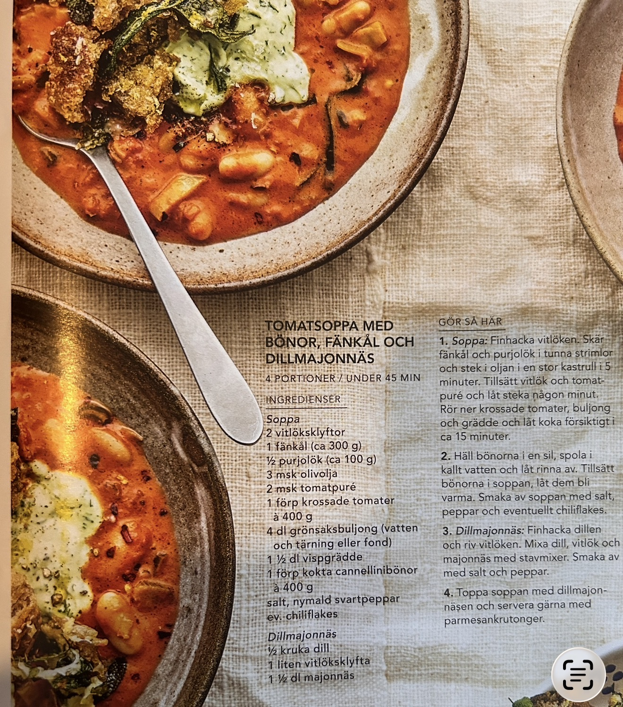

TOMATSOPPA MED BÖNOR, FÄNKÅL OCH DILLMAJONNÄS
4 PORTIONER / UNDER 45 MIN
INGREDIENSER
Soppa
2 vitlöksklyftor
1 fänkål (ca 300 g)
½ purjolök (ca 100 g)
3 msk olivolja
2 msk tomatpuré
1 förp krossade tomater à 400 g
4 dl grönsaksbuljong (vatten och tärning eller fond)
1 ½ dl vispgrädde
1 förp kokta cannellinibönor à 400 g
salt, nymald svartpeppar
ev. chiliflakes
Dillmajonnäs
½ kruka dill
1 liten vitlöksklyfta
1 ½ dl majonnäs
GÖR SÅ HÄR
1. Soppa: Finhacka vitlöken. Skär fänkål och purjolök i tunna strimlor och stek i oljan i en stor kastrull i 5 minuter. Tillsätt vitlök och tomatpuré och låt steka någon minut. Rör ner krossade tomater, buljong och grädde och låt koka försiktigt i ca 15 minuter.
2. Häll bönorna i en sil, spola i kallt vatten och låt rinna av. Tillsätt bönorna i soppan, låt dem bli varma. Smaka av soppan med salt, peppar och eventuellt chiliflakes.
3. Dillmajonnäs: Finhacka dillen och riv vitlöken. Mixa dill, vitlök och majonnäs med stavmixer. Smaka av med salt och peppar.
4. Toppa soppan med dillmajonnäsen och servera gärna med parmesankrutonger.