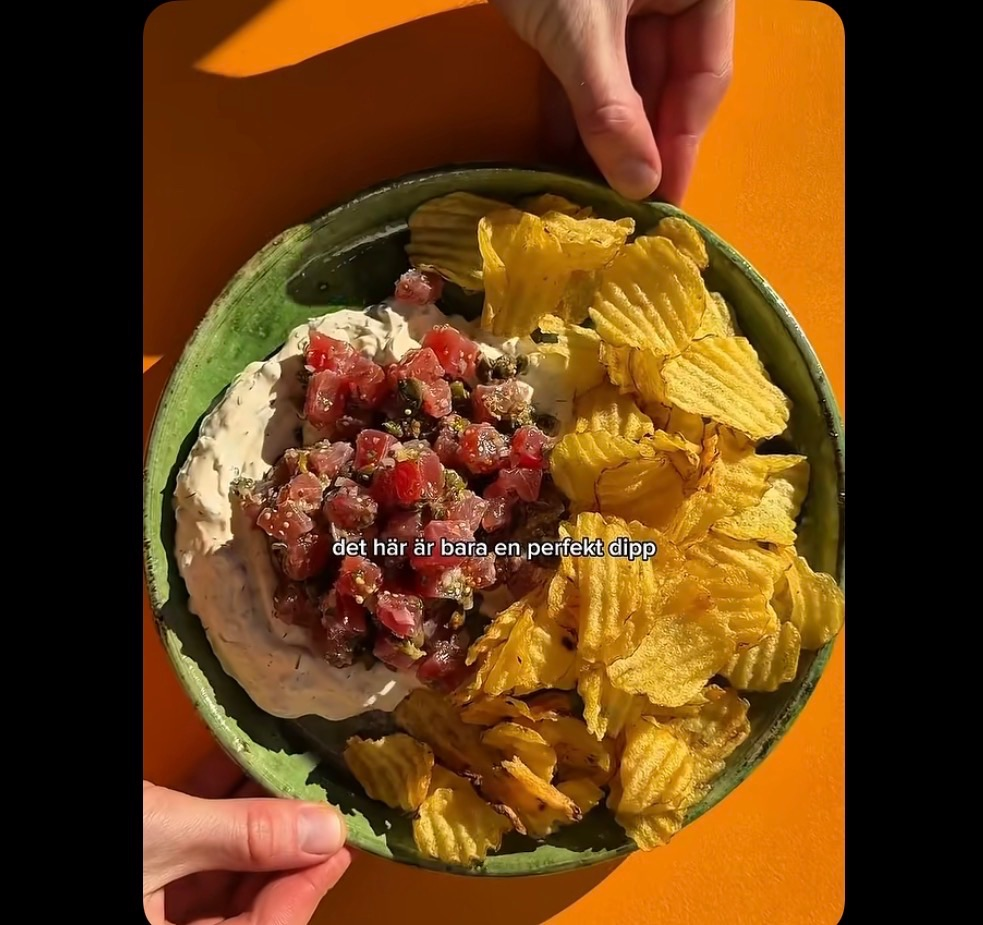

## Ingredienser
Stora kapris för garnityr
200 g tonfisk
3 msk gräslök
Zest från ½ citron
3 msk små kapris
En skvätt citronjuice
1 msk grovkornig senap
1 msk olivolja
Krämigt lager:
0,8 dl smetana
0,5 dl Kewpie-majonnäs
1 msk kapris
3 msk färsk dill, grovhackad
Salt efter smak ½ msk sriracha
½ msk honung Juice från ½ citron
1 msk olivolja
Till servering:
Tunna, lättsaltade chips
1 msk friterad schalottenlök
½ msk gräslök, finhackad

## Beskrivning
Tonfisktartar
Tärna tonfisken i jämna små kuber. Blanda försiktigt ihop med gräslök, olivolja, senap, kapris, citronjuice och citronzest i en skål. Ställ åt sidan i kylen så länge.
Det krämiga lagret
Rör ihop smetana, majonnäs, olivolja, citronjuice, honung och sriracha i en annan skål. Vänd ner hackad dill och kapris. Smaka av med salt. Konsistensen ska vara fyllig och balanserad mellan syra och hetta.
Montering
Bred ut det krämiga lagret i botten på ett fat. Fördela tonfisktartaren jämnt ovanpå.
Topping & Servering
Toppa med finhackad gräslök och friterad
schalottenlök för extra krisp och smak. Servera direk tillsammans med en skal riktigt bra chips.

#Fisk