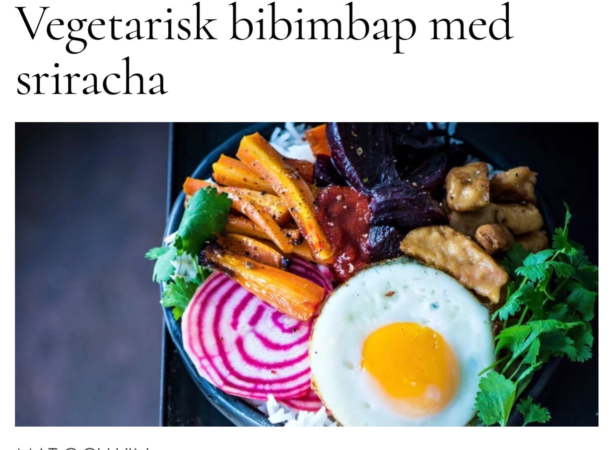

4 personer

BIBIMBAP:
2 morötter

3 rödbetor

1 polkabeta

2 msk flingsalt

nymalen svartpeppar

2 msk rapsolja

250 g hård tofu

2 msk rapsolja

SÅS:
2 msk sesamolja

1 msk soja

2 tsk risvinäger

2 tsk vita sesamfrön

1 tsk socker

1 tsk flingsalt

1/2 msk vitpeppar

TILL SERVERING:
4 ägg

8 dl kokt jasminris

SRIRACHASÅS:
Soja

Koriander

GÖR SÅ HÄR:
Skala polkabetan, hyvla tunt, lägg skivorna i isvatten.
Skala morötter och rödbetor.
Skär moroten i stavar och de röda betorna i bitar.
Ringla över oljan, salta och peppra.
Ugnsbaka på 200° i cirka 40 minuter tills de är mjuka.
Koka riset enligt anvisningarna på förpackningen.
Blanda alla ingredienser till såsen.
Fräs tofun i olja i stekpanna, tillsätt såsen och rör om.
Knäck äggen i stekpannan och stek dem bara på ena sidan, med gulan intakt.
Låt polkabetorna rinna av.
Fördela ris i skålar, lägg på grönsaker och tofu, ringla över all sås.
Lägg sist på ägget.
Servera med srirachamajonnäs, soja och koriander.

#Vegetariskt #Asiatisk