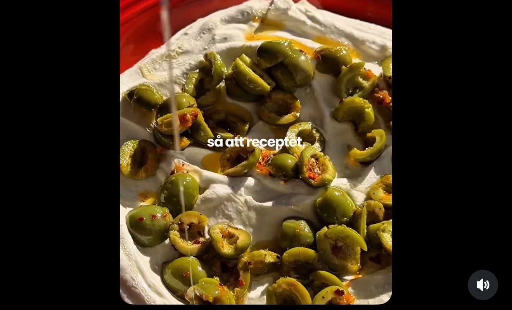

## Ingredienser
500 g ricotta
Salt o peppar
Marinerade oliver & topping:
1 dl urkärnade och delade oliver
1/2 dl olivolja av god kvalitet
2 schalottenlok
1 tsk chiliflakes
Zest från ½ apelsin
2 kvistar rosmarin
Salt o peppar
Flytande honung
Bröd till servering

## Beskrivning
GÖR SÅ HÄR
Fritera
Skär löken i tunna ringar och fritera försiktigt i cirka
160 gradig olja.
Blanda
Blanda olivolja, chiliflakes, rosmarin, oliverna, apelsinzest, en nypa salt samt den friterade löken. Låt detta stå och marinera medan du fixar ricottan.
Vispad ricotta
Lägg den kalla ricottan i en matberedare och mixa tills
den är helt slät. Stanna och skrapa ner sidorna då och då. Tillsätt en nypa salt och peppar mot slutet och kör tills allt är krämigt.
(Detta går utmärkt att förbereda dagen innan och
förvara täckt i kylen).
Montering
Bred ut ricottan på ett fat med lite kant. Skeda över olivblandningen och den aromatiska oljan. Ringla över honung och servera med skivad baguette eller kex.

#Tillbehör #Tapas #Sås